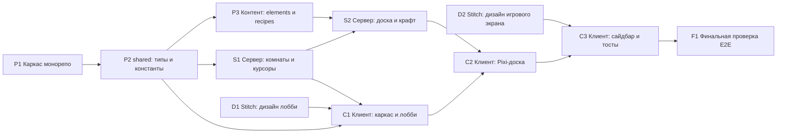

# PLAN.md — Пошаговый план реализации Multiplayer Alchemy

Источник требований: [SPEC.md](SPEC.md). Этот план — единственный документ, которым руководствуется агент-исполнитель. Каждая фаза **атомарна и самодостаточна**: в ней явно указано, какие файлы читать, какие создавать/изменять и как проверить результат. Агент, выполняющий фазу, НЕ должен исследовать проект за пределами файлов, перечисленных в фазе.

---

## 0. Глобальные правила (обязательны для каждой фазы)

### 0.1 Правило владения файлами (No-Conflict Rule)

* Каждая фаза имеет секции **«Читает»** и **«Создаёт/изменяет»**. Трогать файлы вне секции «Создаёт/изменяет» ЗАПРЕЩЕНО.
* Ни одна пара фаз не изменяет один и тот же файл, кроме случаев, где это явно указано (пометка `[extends]` — файл создан ранее, фаза только добавляет в него код, не изменяя существующий).
* Если для выполнения фазы не хватает информации — она есть в файлах секции «Читает» или в [SPEC.md](SPEC.md). Больше нигде искать не нужно.

### 0.2 Правило дизайна (Stitch MCP — ОБЯЗАТЕЛЬНО)

Весь визуальный дизайн (лобби, игровой экран, сайдбар, тосты, цвета, типографика) производится **ТОЛЬКО через MCP-сервер `stitch`** (Google Stitch, сконфигурирован в `.cursor/mcp.json`):

1. Дизайн-фазы (D1, D2) вызывают инструменты Stitch: `create_project`, `generate_screen_from_text`, `get_screen` и т.п. (точные имена — по фактическому списку tools сервера `stitch`).
2. Генерация экрана в Stitch асинхронна и может занимать минуты. Агент ОБЯЗАН **дождаться готового результата**: если инструмент вернул статус «в обработке» / «pending», повторять опрос (`get_screen` / аналогичный tool) с паузой 15–30 секунд до получения готового дизайна (кода экрана и/или скриншота). Лимит ожидания — 15 минут на экран.
3. **СТРОГО ЗАПРЕЩЕНО** придумывать/генерировать дизайн самостоятельно, «пока Stitch отвечает», или как fallback. Если Stitch недоступен (ошибка соединения, нет tools в сессии, исчерпан лимит ожидания) — фаза останавливается с сообщением пользователю о причине. Никакой самодеятельности в дизайне.
4. Результаты Stitch сохраняются в папку `design/` (HTML/код экранов, скриншоты, извлечённые дизайн-токены). Фазы реализации UI (C1, C3) используют `design/` как единственный источник визуальной правды: цвета, шрифты, отступы, компоновка берутся из выгрузки Stitch.
5. Реализация UI — это **перенос** дизайна Stitch на стек проекта (React + Pixi), а не пересочинение. Отклонения допустимы только там, где HTML-выгрузка технически неприменима (например, Pixi-canvas вместо DOM для доски) — но визуальные токены (палитра, шрифты, радиусы) всё равно берутся из Stitch.

### 0.3 Правило верификации

Каждая фаза заканчивается выполнением команд из секции **«Приёмка»**. Фаза считается завершённой только при успехе всех проверок. При провале — исправлять в рамках файлов своей фазы.

### 0.4 Технологический контекст (фиксирован, не пересматривается)

* Монорепо npm workspaces: `shared/`, `server/`, `client/`.
* Server: Node.js + TypeScript + Fastify + Socket.io.
* Client: Vite + React 19 + TypeScript + PixiJS + socket.io-client.
* Порты по умолчанию: сервер — `3001`, клиент (Vite dev) — `5173`. Vite проксирует `/socket.io` на `3001`.
* Windows / PowerShell — команды в фазах писать совместимыми с PowerShell.

### 0.5 Порядок и зависимости фаз



Фазы D1 и D2 не зависят от кода и могут выполняться в любой момент до C1/C3 соответственно.

---

## Фаза P1 — Каркас монорепо

**Цель:** пустой, но собирающийся скелет из трёх workspace-пакетов.

**Читает:** ничего (стартовая фаза; в корне уже существуют `SPEC.md`, `PLAN.md`, `.gitignore`, `.cursor/` — не трогать).

**Создаёт:**

* `package.json` (корень) — `"private": true`, `"workspaces": ["shared", "server", "client"]`, скрипты: `dev:server` (`npm run dev -w server`), `dev:client` (`npm run dev -w client`), `build` (сборка всех трёх по очереди: shared, server, client).
* `tsconfig.base.json` — общие опции: `strict: true`, `target: ES2022`, `module: ESNext`, `moduleResolution: bundler`, `esModuleInterop: true`, `skipLibCheck: true`, `forceConsistentCasingInFileNames: true`.
* `shared/package.json` — имя `@multialchemy/shared`, `"main": "src/index.ts"`, `"types": "src/index.ts"`, скрипт `build: tsc --noEmit`.
* `shared/tsconfig.json` — extends `../tsconfig.base.json`, `include: ["src"]`.
* `shared/src/index.ts` — временно `export {};` (заполнит P2).
* `server/package.json` — имя `@multialchemy/server`, зависимости: `fastify`, `socket.io`, `@multialchemy/shared` (`"*"`), dev: `tsx`, `typescript`, `@types/node`; скрипты: `dev: tsx watch src/index.ts`, `build: tsc --noEmit`.
* `server/tsconfig.json` — extends база, `include: ["src"]`.
* `server/src/index.ts` — временно: создание Fastify, `console.log("server stub")`, без прослушивания порта (заполнит S1).
* `client/` — стандартный Vite-проект react-ts (создать вручную по шаблону, БЕЗ `npm create vite`, чтобы не получить интерактивный промпт): `client/package.json` (зависимости `react@^19`, `react-dom@^19`, `socket.io-client`, `pixi.js@^8`, `@multialchemy/shared`; dev: `vite`, `@vitejs/plugin-react`, `typescript`, `@types/react`, `@types/react-dom`), `client/tsconfig.json`, `client/vite.config.ts` (plugin react + `server.proxy: { "/socket.io": { target: "http://localhost:3001", ws: true } }`), `client/index.html` (`<div id="root">`, title «Multiplayer Alchemy»), `client/src/main.tsx` (рендер `<App />`), `client/src/App.tsx` (временно `<h1>stub</h1>`, заменит C1).
* Дополнить существующий `.gitignore` строками: `node_modules/`, `dist/`, `design/*.tmp` (файл уже содержит `.cursor/mcp.json` — сохранить).

**Действия после создания файлов:** `npm install` в корне.

**Приёмка:**

```powershell
npm install            # завершается без ошибок
npm run build          # tsc по всем трём пакетам — 0 ошибок
```

---

## Фаза P2 — shared: контракт типов и константы

**Цель:** единый источник правды для моделей и событий из разделов 2 и 3 SPEC.md.

**Читает:** [SPEC.md](SPEC.md) разделы 2–4, `shared/src/index.ts`.

**Создаёт/изменяет:**

* `shared/src/types.ts` — НОВЫЙ файл. Интерфейсы точно по SPEC: `Element`, `Recipe`, `BoardInstance` (с `createdAt: number`), `Player`, `RoomState`, `RoomStatePayload` (= `RoomState & { elements: Element[]; totalElements: number }`), `RoomErrorPayload` (`code: "NOT_FOUND" | "FULL"`), а также типизированные карты событий Socket.io: `ClientToServerEvents` (8 событий из §3.1) и `ServerToClientEvents` (14 событий из §3.2) — имена и payload'ы СТРОГО по таблицам SPEC.
* `shared/src/constants.ts` — НОВЫЙ файл: `HITBOX_RADIUS = 40`, `BOARD_LIMIT = 150`, `MAX_PLAYERS = 8`, `ROOM_GRACE_MS = 60_000`, `CLEAR_COOLDOWN_MS = 5_000`, `CURSOR_THROTTLE_MS = 40`, `SERVER_BATCH_HZ = 20`, `PLAYER_NAME_MAX = 20`, `PLAYER_COLORS: string[]` (палитра из 8 контрастных HEX-цветов), `ROOM_ID_LENGTH = 6`, `ROOM_ID_ALPHABET = "ABCDEFGHJKMNPQRSTUVWXYZ23456789"`.
* `shared/src/index.ts` — заменить заглушку на `export * from "./types"; export * from "./constants";`.

**Приёмка:**

```powershell
npm run build -w shared   # 0 ошибок
```

---

## Фаза P3 — Контент: elements.json и recipes.json

**Цель:** база знаний игры — 4 базовых элемента + дерево из 50+ элементов и 55+ рецептов.

**Читает:** `shared/src/types.ts` (формы `Element` и `Recipe`), [SPEC.md](SPEC.md) §2.2.

**Создаёт:**

* `server/src/data/elements.json` — массив `Element[]`. Ровно 4 элемента с `isBase: true`: `water` (Вода, 💧), `fire` (Огонь, 🔥), `earth` (Земля, 🌍), `air` (Воздух, 💨). Плюс 46+ производных (`isBase: false`) с эмодзи-иконками и русскими именами: пар, лава, камень, озеро, растение, жизнь, человек и т.д. — глубина дерева 4–5 уровней.
* `server/src/data/recipes.json` — массив `Recipe[]`, 55+ штук. Инварианты: (1) `id` = отсортированные по алфавиту `elementId` через `:`; (2) `ingredients` отсортированы так же; (3) каждый `result` и каждый ингредиент существуют в `elements.json`; (4) каждый небазовый элемент достижим от базовых; (5) допускаются рецепты «X + X»; (6) дубликатов `id` нет.
* `server/src/data/validate.ts` — скрипт самопроверки: читает оба JSON, проверяет инварианты 1–6, при нарушении — `process.exit(1)` с перечнем ошибок, при успехе печатает `OK: N elements, M recipes`.

**Приёмка:**

```powershell
npx tsx server/src/data/validate.ts   # OK: ...
```

---

## Фаза S1 — Сервер: комнаты, игроки, курсоры

**Цель:** рабочий Socket.io-сервер: создание/вход в комнаты, список игроков, батч-рассылка курсоров.

**Читает:** `shared/src/types.ts`, `shared/src/constants.ts`, `server/src/index.ts` (заглушка из P1), [SPEC.md](SPEC.md) §2.5, §3, §4.5.

**Создаёт/изменяет:**

* `server/src/roomManager.ts` — НОВЫЙ. Класс/модуль: `Map<roomId, RoomState>`; `createRoom()` (генерация уникального 6-значного кода из `ROOM_ID_ALPHABET`); `getRoom(roomId)`; `addPlayer(roomId, socketId, name)` (обрезка имени до `PLAYER_NAME_MAX`, выдача цвета из `PLAYER_COLORS` по числу игроков, отказ при `MAX_PLAYERS`); `removePlayer`; таймер удаления пустой комнаты через `ROOM_GRACE_MS` (отменяется, если кто-то вошёл). При старте комнаты `unlockedElements` = все `id` с `isBase: true` из `elements.json`.
* `server/src/index.ts` — ЗАМЕНИТЬ заглушку: Fastify на порту 3001, привязка Socket.io с типами `ClientToServerEvents/ServerToClientEvents` из shared, загрузка `data/elements.json` и `data/recipes.json` в память (рецепты — в `Map<string, Recipe>`). Обработчики: `room:create`, `room:join` (вход в socket.io-room, ответ `room:state` с каталогом элементов и `totalElements`, рассылка `room:player_joined` остальным; ошибки — `room:error` с `NOT_FOUND`/`FULL`), `cursor:move` (записать в `RoomState`, НЕ ретранслировать сразу), `disconnect` (снять локи игрока с рассылкой `element:unlocked`, удалить из players, разослать `room:player_left`, запустить grace-таймер, если комната опустела). Интервал `1000 / SERVER_BATCH_HZ` мс: рассылка `room:sync_cursors` по каждой активной комнате. Экспортировать функцию `getIo()`/контекст для S2 НЕ нужно — S2 будет дописывать обработчики в этом же файле через отдельный модуль (см. S2).
* `server/src/gameLogic.ts` — НОВЫЙ, пока каркас: экспорт функции `registerBoardHandlers(io, socket, ctx)` с пустым телом и TODO-комментарием `// S2`; вызвать её из `index.ts` при подключении сокета. (Так S2 не будет менять логику S1 в `index.ts`.)

**Приёмка:**

```powershell
npm run build -w server        # 0 ошибок
npm run dev:server             # в фоне; затем smoke-тест:
npx tsx server/test/smoke-s1.ts
```

* `server/test/smoke-s1.ts` — создать в этой же фазе: скрипт на `socket.io-client`: клиент A шлёт `room:create`, получает `room:state` с `roomId` и 4 базовыми элементами в `unlockedElements`; клиент B шлёт `room:join` с этим кодом, A получает `room:player_joined`; B шлёт `room:join` с кодом `ZZZZZZ` вторым сокетом — получает `room:error NOT_FOUND`. Печатает `SMOKE S1 OK` и завершает процесс.

---

## Фаза S2 — Сервер: доска, локи, крафт

**Цель:** полная игровая логика по §3.1, §4.1–§4.4 SPEC.

**Читает:** `shared/src/*`, `server/src/roomManager.ts`, `server/src/gameLogic.ts` (каркас), `server/src/index.ts` (только чтобы понять сигнатуру `registerBoardHandlers` и контекст `ctx` — НЕ изменять), [SPEC.md](SPEC.md) §4.

**Создаёт/изменяет:**

* `server/src/gameLogic.ts` — `[extends]` заполнить `registerBoardHandlers`: обработчики `element:spawn` (валидация `unlockedElements`; лимит `BOARD_LIMIT` с вытеснением старейшего незалоченного по `createdAt` и рассылкой `board:removed`; UUID через `crypto.randomUUID()`; рассылка `element:spawned`), `element:lock` (если свободен — лок + `element:locked` всем; занят — персональный `element:lock_denied`), `element:drag` (только от владельца лока; копить в буфер изменений комнаты), `element:release` (снять лок + `element:unlocked`; поиск ближайшего незалоченного соседа с дистанцией центров `< 2 * HITBOX_RADIUS`; ключ `[a,b].sort().join(":")` в Map рецептов; успех — удалить оба, создать результат в середине отрезка, обновить `unlockedElements` при новом открытии, разослать `craft:success` с `discoveredBy` = имя игрока; иначе `craft:fail`), `board:clear` (cooldown `CLEAR_COOLDOWN_MS` на комнату; очистка `boardInstances`, рассылка `board:cleared`). Плюс экспорт `flushBoardUpdates(io, room)` — рассылка накопленного буфера драгов как `board:update_instances`; подключить его к уже существующему 20 Гц интервалу добавлением ОДНОЙ строки вызова в `index.ts` (единственное разрешённое изменение `index.ts`, место помечено TODO из S1).
* `server/test/smoke-s2.ts` — НОВЫЙ smoke-тест: два клиента в одной комнате; A спавнит `water` и `fire`, тащит `water` к `fire`, отпускает рядом — оба получают `craft:success` с результатом по рецепту и `isNewDiscovery: true`; повторный крафт — `isNewDiscovery: false`; спавн неоткрытого элемента игнорируется; одновременный `element:lock` от двух клиентов — второй получает `element:lock_denied`. Печатает `SMOKE S2 OK`.

**Приёмка:**

```powershell
npm run build -w server
# при запущенном dev:server:
npx tsx server/test/smoke-s2.ts   # SMOKE S2 OK
```

---

## Фаза D1 — Stitch: дизайн экрана лобби

**Цель:** получить от Google Stitch готовый дизайн лобби и сохранить его артефакты в `design/`.

**Читает:** [SPEC.md](SPEC.md) §5 (описание лобби). Кодовую базу НЕ читает и НЕ изменяет.

**Инструменты:** ТОЛЬКО MCP-сервер `stitch` + запись файлов в `design/`. Соблюдать правило 0.2 (ждать ответа, опрашивать статус, НИКАКОЙ собственной генерации дизайна).

**Действия:**

1. Через Stitch создать проект (например, `create_project` с названием "Multiplayer Alchemy") ЛИБО использовать уже существующий проект с таким названием, если он есть в `list_projects`. Сохранить `projectId` в `design/stitch-project.json` (`{ "projectId": "..." }`).
2. Сгенерировать экран лобби (`generate_screen_from_text`, deviceType — DESKTOP/WEB): промпт на английском, описывающий: dark fantasy-alchemy themed lobby for a web game "Multiplayer Alchemy"; centered card with game logo/title, name input (max 20 chars), two prominent buttons "Create Room" and "Join by Code", room-code input of 6 characters; magical/mystical palette, glassmorphism welcome.
3. **Дождаться** готовности экрана (правило 0.2 п.2). Получить итоговый код/разметку экрана и скриншот (инструментами вида `get_screen` / `fetch_screen_code` / `fetch_screen_image` — по фактическому списку tools).
4. Сохранить: `design/lobby.html` (выгруженный код), `design/lobby.png` (скриншот, если доступен), `design/tokens.md` — извлечённые ИЗ ОТВЕТА STITCH токены: HEX-палитра, шрифты, размеры/радиусы, стиль кнопок и инпутов, идентификатор экрана в Stitch.

**Создаёт:** `design/stitch-project.json`, `design/lobby.html`, `design/lobby.png`, `design/tokens.md`.

**Приёмка:** все четыре файла существуют и непусты; `design/tokens.md` содержит палитру и шрифты, взятые из ответа Stitch (с указанием `screenId`). Если Stitch не ответил за лимит ожидания — фаза НЕ выполнена, о чём сообщается пользователю (без подмены дизайна).

---

## Фаза D2 — Stitch: дизайн игрового экрана

**Цель:** дизайн основного игрового экрана (доска + сайдбар + шапка + тосты) от Stitch.

**Читает:** [SPEC.md](SPEC.md) §5, `design/stitch-project.json`, `design/tokens.md` (для консистентности с D1). Кодовую базу НЕ читает и НЕ изменяет.

**Инструменты:** ТОЛЬКО MCP `stitch` + запись в `design/`. Правило 0.2 обязательно.

**Действия:**

1. В том же Stitch-проекте сгенерировать экран игровой комнаты: top bar with room code badge, player avatars (colored dots), "Clear board" button; main area — large game board canvas with draggable element chips (emoji + label) and other players' colored cursors with name tags; right sidebar — searchable library of discovered elements with progress counter "12 / 58" at the bottom; toast notification example "Player discovered: Steam". Стиль — тот же, что в D1 (сослаться в промпте на консистентность, можно передать контекст первого экрана, если tools это поддерживают).
2. **Дождаться** результата (правило 0.2 п.2).
3. Сохранить `design/game.html`, `design/game.png`, дополнить `design/tokens.md` секцией «Game screen» (цвета чипов элементов, обводки локов, стиль сайдбара и тостов — из ответа Stitch).

**Создаёт/изменяет:** `design/game.html`, `design/game.png`, `design/tokens.md` `[extends]`.

**Приёмка:** `design/game.html` и `design/game.png` существуют и непусты; `tokens.md` дополнен. При недоступности Stitch — стоп без fallback.

---

## Фаза C1 — Клиент: каркас, сеть, лобби

**Цель:** React-приложение с экраном лобби (по дизайну D1) и типизированным сокет-слоем; вход в комнату работает.

**Читает:** `shared/src/*`, `client/src/App.tsx` (заглушка), `client/vite.config.ts`, `design/lobby.html`, `design/tokens.md`, [SPEC.md](SPEC.md) §3, §5.

**Создаёт/изменяет:**

* `client/src/net/socket.ts` — НОВЫЙ: `io()` c типами `Socket<ServerToClientEvents, ClientToServerEvents>`, singleton-экспорт, helper `throttle(fn, CURSOR_THROTTLE_MS)`.
* `client/src/state/gameStore.ts` — НОВЫЙ: лёгкий стор на `useSyncExternalStore` (без внешних библиотек): `phase: "lobby" | "room"`, `roomState`, `elements: Map<string, Element>`, `totalElements`, `selfSocketId`, `lastError`; экшены-подписки на `room:state`, `room:error`, `room:player_joined`, `room:player_left`, `craft:success` (обновление `unlockedElements`).
* `client/src/ui/Lobby.tsx` — НОВЫЙ: вёрстка ПО `design/lobby.html` (структура, палитра, шрифты, радиусы — из выгрузки Stitch; стили — CSS-модуль или обычный CSS-файл `client/src/ui/lobby.css`, скопировать значения из дизайна). Поле имени, «Создать комнату» (`room:create`), поле кода + «Войти» (`room:join`), показ `lastError`. Имя и roomId сохранять в `sessionStorage` (нужно для реконнекта, §4.5).
* `client/src/App.tsx` — ЗАМЕНИТЬ заглушку: глобальные стили-токены (CSS-переменные из `design/tokens.md`), переключение `phase`: `lobby` → `<Lobby/>`, `room` → `<RoomScreen/>` (временный компонент-заглушка `client/src/ui/RoomScreen.tsx` с текстом кода комнаты — заменит C2/C3). Автопере-join при реконнекте: на `socket.on("connect")`, если в `sessionStorage` есть roomId+имя — отправить `room:join`.

**Приёмка:**

```powershell
npm run build -w client        # tsc + vite build, 0 ошибок
```

Ручная проверка (dev:server + dev:client): создать комнату в одной вкладке, войти по коду во второй — обе в фазе `room`, вторая вкладка при неверном коде видит ошибку. Визуал лобби соответствует `design/lobby.png`.

---

## Фаза C2 — Клиент: Pixi-доска (курсоры, drag-and-drop, LERP)

**Цель:** интерактивная доска: спавн, перетаскивание с локами, чужие курсоры, интерполяция, крафт-события.

**Читает:** `shared/src/*`, `client/src/net/socket.ts`, `client/src/state/gameStore.ts`, `client/src/ui/RoomScreen.tsx` (заглушка C1), `design/game.html` + `design/tokens.md` (вид чипов элементов, курсоров, обводок), [SPEC.md](SPEC.md) §4.1–§4.4.

**Создаёт/изменяет:**

* `client/src/board/BoardScene.ts` — НОВЫЙ: класс поверх Pixi `Application`: контейнеры `instances` и `cursors`; методы `addInstance/removeInstance/setInstanceTarget/lockInstance/unlockInstance/updateCursor/removeCursor/clear`; чип элемента = скруглённый прямоугольник + эмодзи + подпись (цвета/радиусы из `design/tokens.md`), обводка цветом владельца при локе; курсор = стрелка цвета игрока + имя. В `ticker`: LERP `alpha = 0.2` к целевым координатам для ЧУЖИХ объектов и курсоров; свои (залоченные мной) двигаются мгновенно (Optimistic UI).
* `client/src/board/useBoard.ts` — НОВЫЙ React-хук: монтирует `BoardScene` в div; подписки: `element:spawned`, `element:locked/unlocked/lock_denied` (denied — откат локального захвата на прежние координаты), `board:update_instances`, `board:removed`, `board:cleared`, `craft:success` (удалить `destroyedIds`, заспавнить `newInstance` с анимацией масштаба 0→1), `craft:fail` (короткая анимация отталкивания двух инстансов). Исходящие: `mousemove` по доске → `cursor:move` (троттлинг 40 мс); mousedown по чипу → оптимистичный захват + `element:lock`; движение при захвате → локальное перемещение + `element:drag` (троттлинг 40 мс); mouseup → `element:release`; drop из сайдбара (HTML5 DnD, тип `application/x-element-id`) → `element:spawn` с координатами в системе доски.
* `client/src/ui/RoomScreen.tsx` — ЗАМЕНИТЬ заглушку: full-height layout по `design/game.html`: слот шапки и слот сайдбара (заполнит C3, пока пустые div c классами из дизайна), центр — div доски с `useBoard`.

**Приёмка:**

```powershell
npm run build -w client   # 0 ошибок
```

Ручная проверка в двух вкладках: спавн виден обеим; перетаскивание в одной — плавное (LERP) движение во второй; одновременный захват — у второй вкладки откат; вода+огонь → оба чипа исчезают, появляется результат.

---

## Фаза C3 — Клиент: шапка, сайдбар-библиотека, тосты

**Цель:** полный UI игрового экрана по дизайну D2.

**Читает:** `shared/src/*`, `client/src/state/gameStore.ts`, `client/src/ui/RoomScreen.tsx` (слоты из C2), `design/game.html`, `design/tokens.md`, [SPEC.md](SPEC.md) §5.

**Создаёт/изменяет:**

* `client/src/ui/TopBar.tsx` — НОВЫЙ: бейдж кода комнаты (клик — копирование в буфер), цветные точки игроков с тултипом имени, кнопка «Очистить доску» (`board:clear`). Вёрстка/стили — по `design/game.html`.
* `client/src/ui/Library.tsx` — НОВЫЙ: сайдбар: поиск по имени, сетка/список открытых элементов (эмодзи + имя), элементы draggable (`dataTransfer.setData("application/x-element-id", id)`), внизу счётчик `unlockedElements.length / totalElements`. Стили — по дизайну.
* `client/src/ui/Toasts.tsx` — НОВЫЙ: очередь тостов (авто-скрытие 4 с): `craft:success` c `isNewDiscovery` → «{discoveredBy} открыл: {имя элемента}»; `room:player_joined` / `room:player_left` → вход/выход. Стили — по дизайну.
* `client/src/ui/RoomScreen.tsx` — `[extends]` вставить `<TopBar/>`, `<Library/>`, `<Toasts/>` в слоты, размеченные в C2.

**Приёмка:**

```powershell
npm run build -w client   # 0 ошибок
```

Ручная проверка: перетаскивание из библиотеки спавнит элемент; открытие нового элемента даёт тост и обновляет счётчик у ОБЕИХ вкладок; «Очистить доску» очищает у всех; визуал соответствует `design/game.png`.

---

## Фаза F1 — Финальная E2E-проверка (Definition of Done)

**Цель:** подтвердить DoD из SPEC §6 и зафиксировать инструкции запуска.

**Читает:** весь проект разрешено читать (единственная фаза без ограничений чтения). Изменяет только перечисленное ниже.

**Действия и проверки:**

1. `npm run build` — 0 ошибок по всем пакетам.
2. `npx tsx server/src/data/validate.ts` — OK.
3. При запущенных dev:server и dev:client оба smoke-теста (`smoke-s1`, `smoke-s2`) проходят.
4. Ручной чек-лист DoD в двух браузерных вкладках: вход в одну комнату; взаимные курсоры и перетаскивания; совместное открытие элемента (тост + библиотека у обоих); F5 одной вкладки — авто-возврат в комнату с сохранённым состоянием (grace-период); лимит доски и cooldown очистки не ломают сессию.
5. Найденные дефекты чинить точечно, указывая в отчёте файл и причину.

**Создаёт:** `README.md` — краткое описание игры, требования (Node 20+), команды: `npm install`, `npm run dev:server`, `npm run dev:client`, адрес `http://localhost:5173`, структура репо, ссылка на SPEC.md и PLAN.md.

**Приёмка:** все пункты 1–4 зелёные; `README.md` существует.

---

## Сводная матрица владения файлами

| Файл/папка | Создаёт | Изменяет позже |
| :--- | :--- | :--- |
| `package.json`, `tsconfig.base.json`, `client/*` (каркас) | P1 | — |
| `shared/src/types.ts`, `constants.ts`, `index.ts` | P1/P2 | — |
| `server/src/data/*` | P3 | — |
| `server/src/roomManager.ts` | S1 | — |
| `server/src/index.ts` | P1 (заглушка) | S1 (замена), S2 (одна строка по TODO) |
| `server/src/gameLogic.ts` | S1 (каркас) | S2 `[extends]` |
| `server/test/smoke-s1.ts` / `smoke-s2.ts` | S1 / S2 | — |
| `design/*` | D1, D2 | — |
| `client/src/net/socket.ts`, `state/gameStore.ts`, `ui/Lobby.tsx`, `App.tsx` | C1 | — |
| `client/src/board/*` | C2 | — |
| `client/src/ui/RoomScreen.tsx` | C1 (заглушка) | C2 (замена), C3 `[extends]` |
| `client/src/ui/TopBar.tsx`, `Library.tsx`, `Toasts.tsx` | C3 | — |
| `README.md` | F1 | — |
