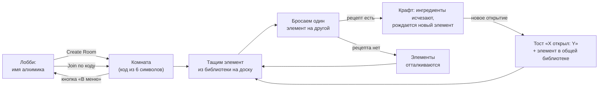

# Multiplayer Alchemy

Кооперативная браузерная «Алхимия» в реальном времени — по мотивам Little Alchemy и Doodle God,
но на общей доске. Игроки собираются в комнате по короткому коду, перетаскивают элементы,
скрещивают их и вместе открывают всю библиотеку — от четырёх стихий до человека и парохода.

> Полная спецификация — в [SPEC.md](SPEC.md), план реализации по фазам — в [PLAN.md](PLAN.md).

---

## Как играется

В комнате всё общее: доска, библиотека открытых элементов, курсоры и действия друг друга.
Каждое движение видно всем без перезагрузок — сервер авторитарен, клиенты только отправляют
намерения и рендерят подтверждённое состояние.

* **4 базовых элемента** — Вода, Огонь, Земля, Воздух — доступны с самого начала.
* **67 элементов и 63 рецепта** глубиной до 4–5 уровней: пар, лава, камень, растение, жизнь…
* **Открытия общие на комнату**: как только один игрок получил новый элемент, он появляется
  в библиотеке у всех, а прогресс комнаты (`открыто / всего`) растёт.
* До **8 игроков** в комнате, каждый со своим цветом курсора.

## Player flow



### Шаг за шагом

1. **Лобби.** Игрок вводит имя алхимика и либо создаёт комнату, либо вводит 6-значный код
   существующей. Код нечувствителен к похожим символам (без `I`, `L`, `O`, `0`, `1`).
2. **Комната.** По центру — рабочая доска, справа — библиотека открытых элементов с поиском
   и прогрессом комнаты, в шапке — код комнаты (клик — копирование), индикаторы игроков,
   «Очистить доску» и «В меню».
3. **Спавн.** Элемент перетаскивается из библиотеки на доску (столько раз, сколько нужно —
   инстансы независимы).
4. **Крафт.** Один элемент бросается на другой. Если центры ближе двойного радиуса хитбокса,
   сервер ищет рецепт: успех — оба ингредиента исчезают и с pop-анимацией появляется результат;
   неудача — элементы визуально отталкиваются.
5. **Открытие.** Если результат — новый для комнаты элемент, все видят тост
   «*Имя* открыл: *Элемент*», а библиотека пополняется мгновенно у каждого.
6. **Параллельная работа.** Игроки одновременно ведут разные ветки дерева рецептов, наблюдая
   курсоры и перетаскивания друг друга в реальном времени.

## Управление и механики

| Действие | Как | Что происходит под капотом |
| :--- | :--- | :--- |
| Взять элемент | Зажать ЛКМ на чипе | Оптимистичный захват + лок на сервере: чип подсвечивается цветом владельца, другие игроки взять его не могут |
| Перетащить | Вести мышь с зажатой ЛКМ | Координаты летят на сервер (троттлинг 40 мс), остальные видят движение с LERP-сглаживанием |
| Скрафтить | Отпустить элемент рядом с другим | Сервер валидирует рецепт и атомарно заменяет пару на результат |
| **Удалить элемент** | Вытащить чип за пределы доски и отпустить | Чип следует за курсором по всему экрану с красным бейджем-корзиной — дроп снаружи удаляет инстанс у всех |
| Очистить доску | Кнопка «Очистить доску» | Все инстансы сняты; cooldown 5 с на комнату |
| Выйти в меню | Кнопка «В меню» | Игрок покидает комнату: его локи снимаются, курсор исчезает у остальных |
| Скопировать код | Клик по бейджу кода в шапке | Код комнаты в буфере обмена — зовите друзей |

Дополнительно:

* **Лимит доски — 150 инстансов**: при переполнении вытесняется самый старый незалоченный чип.
* **Реконнект**: при обрыве связи socket.io переподключается, клиент автоматически возвращается
  в свою комнату с актуальным состоянием доски.
* **Хранилище комнат**: прогресс и доска сохраняются на диск (`server/.data/rooms.json`) и
  переживают перезапуск сервера. Код комнаты можно ввести снова через дни — открытые элементы
  и расстановка на доске останутся. Если комнатой **не пользовались 7 дней**, её данные
  удаляются автоматически. Онлайн-игроки, курсоры и активные локи не сохраняются — только
  «алхимический» прогресс комнаты.

## Архитектура

**Authoritative Server**: клиент — тонкий рендерер, отправляющий интенты; сервер валидирует их,
меняет состояние и транслирует события всем в комнате. Клиент никогда не решает
сам, произошёл ли крафт, — это исключает рассинхронизацию.

| Слой | Технология |
| :--- | :--- |
| Frontend | React 19 + TypeScript + Vite |
| Рендеринг доски | PixiJS (WebGL): чипы, чужие курсоры, интерполяция |
| Backend | Node.js + Fastify + Socket.io |
| Состояние комнат | In-memory + файловое хранилище `server/.data/rooms.json` (TTL 7 дней) |
| База знаний | `elements.json` / `recipes.json` / `hints.json`, read-only на сервере |

### Хранилище комнат

Сервер сохраняет для каждой комнаты:

* открытые элементы (`unlockedElements`);
* все инстансы на доске (`boardInstances`);
* метку последней активности (`updatedAt`).

Сохранение срабатывает при любом изменении прогресса или доски и при выходе игроков.
При старте сервера комнаты поднимаются из файла; просроченные записи (старше 7 дней без
активности) удаляются. Файл хранилища в `.gitignore` — это runtime-данные, не часть репозитория.

## Редактор базы (dev-утилита)

В репозитории есть отдельный пакет `editor/` — локальное оконное приложение для правки
`elements.json`, `recipes.json` и `hints.json`. Оно **не входит в сборку игры** и игрокам
не нужно: это инструмент для разработки контента.

```powershell
npm run dev:editor
```

Подробности — в [editor/README.md](editor/README.md).

## Требования

* Node.js 20+
* npm 10+

## Запуск

```powershell
npm install
npm run dev:server   # сервер на http://localhost:3001
npm run dev:client   # клиент (Vite) на http://localhost:5173
```

Откройте `http://localhost:5173` в двух вкладках или браузерах: в первой создайте
комнату, во второй войдите по 6-значному коду из шапки.

## Структура репозитория

| Путь | Назначение |
| :--- | :--- |
| `shared/` | Общий контракт: типы событий Socket.io и константы (`@multialchemy/shared`) |
| `server/` | Authoritative-сервер: Fastify + Socket.io, комнаты, локи, крафт (`server/src`), контент (`server/src/data`), хранилище комнат (`server/.data/`), smoke-тесты (`server/test`) |
| `client/` | Клиент: Vite + React 19 + PixiJS, лобби, доска, библиотека элементов |
| `editor/` | Локальный редактор базы (Electron): элементы, рецепты, подсказки — только для разработки |
| `design/` | Выгрузки дизайна из Google Stitch — источник правды для UI |

## Проверки

```powershell
npm run build                             # typecheck + сборка игры (shared, server, client)
npm run build -w editor                   # только UI редактора (опционально)
npx tsx server/src/data/validate.ts       # валидация elements / recipes / hints
# при запущенном dev:server:
npx tsx server/test/smoke-s1.ts           # комнаты, вход, ошибки
npx tsx server/test/smoke-s2.ts           # доска, локи, крафт
```
