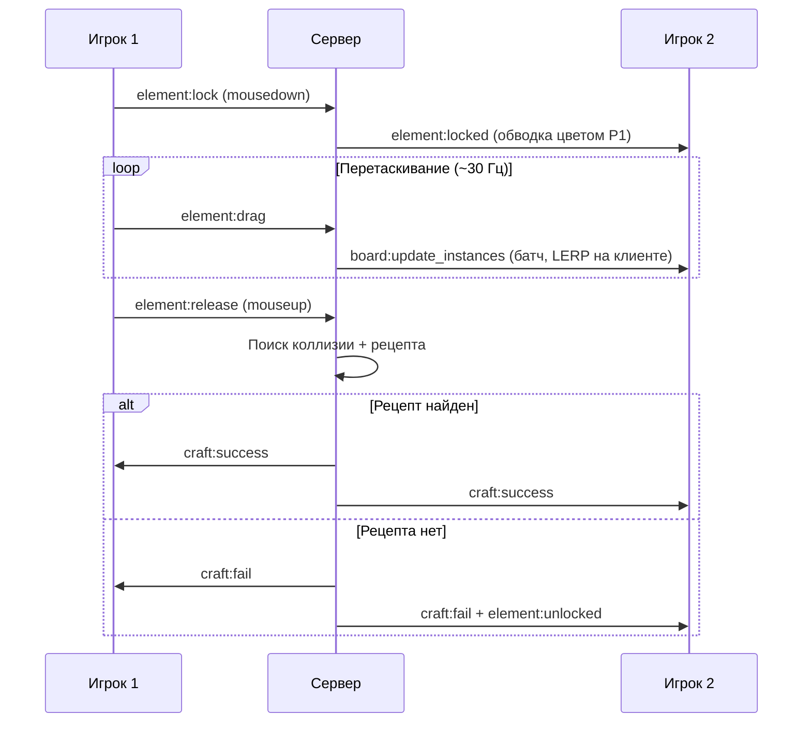

# Спецификация проекта: Multiplayer Alchemy

## 0. Замысел игры

**Multiplayer Alchemy** — кооперативная браузерная игра в жанре «алхимии» (по мотивам Little Alchemy / Doodle God). Игроки перетаскивают элементы по общей доске и скрещивают их, получая новые. Ключевое отличие — **мультиплеер в реальном времени**:

* Игрок создаёт комнату и делится коротким кодом с друзьями.
* Все участники комнаты видят одну и ту же доску, курсоры и действия друг друга без задержек.
* Библиотека открытых элементов **общая на комнату**: открытие любого игрока мгновенно становится доступно всем.
* Цель сессии — совместно открыть как можно больше элементов (прогресс отображается как `открыто / всего`).

### Пользовательский сценарий (Happy Path)

1. Игрок открывает сайт, вводит имя и либо создаёт комнату, либо вводит код существующей.
2. Попадает на доску: слева/справа — сайдбар-библиотека открытых элементов, по центру — рабочее поле.
3. Перетаскивает «Воду» из библиотеки на доску, затем «Огонь» — и бросает один элемент на другой.
4. Сервер находит рецепт, оба элемента исчезают, появляется «Пар». Все игроки видят анимацию, элемент добавляется в общую библиотеку, всплывает уведомление «Никита открыл: Пар».
5. Игроки параллельно работают над разными ветками дерева рецептов, наблюдая курсоры и перетаскивания друг друга в реальном времени.

### Не входит в объём (Non-goals)

* Аккаунты, авторизация, персистентный прогресс между сессиями (комната живёт, пока в ней есть игроки).
* Соревновательный режим, рейтинги.
* Мобильные жесты (только desktop, мышь). Адаптив — best effort.
* Горизонтальное масштабирование сервера (один процесс Node.js достаточен для MVP).

---

## 1. Системная архитектура и Стек технологий

Проект строится на базе архитектуры **Authoritative Server** (авторитарный сервер). Клиент является тонким рендерером, который отправляет интенты (намерения) пользователя, а сервер валидирует их, изменяет состояние и транслирует его всем участникам комнаты. Клиент никогда не решает сам, произошёл ли крафт, — это защищает от рассинхронизации и читерства.

```
   +------------+             +------------+
   |  Клиент 1  | <=========> |            |
   +------------+  WebSockets |            |
                              |  Сервер    | ===> [ Память процесса / RAM ]
   +------------+  WebSockets |  (Node.js) |      (State комнат, Лобби)
   |  Клиент 2  | <=========> |            |
   +------------+             +------------+
                                    |
                                    v
                          [ recipes.json / elements.json ]
                          (статичная база знаний, read-only)
```

### Стек технологий

| Слой | Технология | Обоснование |
| :--- | :--- | :--- |
| **Frontend** | React 19 + TypeScript + Vite | Компонентный подход для интерфейса (библиотека, лобби, уведомления). |
| **Рендеринг доски** | PixiJS (Canvas/WebGL) | Высокая производительность при отрисовке 100+ движущихся объектов и курсоров. React управляет UI-обвязкой, Pixi — сценой доски. |
| **Backend** | Node.js + Fastify + TypeScript | Быстрая обработка асинхронных I/O операций и WebSocket-соединений. |
| **Протокол сети** | Socket.io | Нативная поддержка комнат (Rooms), автоматическое восстановление соединения, fallback на HTTP long-polling. |
| **Хранилище данных** | In-memory (`Map<roomId, RoomState>`) | Состояния комнат живут в RAM для минимальных задержек. Персистентность не требуется (см. Non-goals). |
| **База знаний** | JSON-файлы (`elements.json`, `recipes.json`) | Статичный контент, загружается сервером при старте и отдаётся клиенту один раз при подключении. |

### Структура репозитория (монорепо)

```
MultiAlchemy/
├── shared/            # Общие типы и константы (Element, Recipe, события)
│   └── src/types.ts   # Единый источник правды для контрактов клиент<->сервер
├── server/
│   └── src/
│       ├── index.ts        # Точка входа, Fastify + Socket.io
│       ├── roomManager.ts  # Создание/удаление комнат, реестр RoomState
│       ├── gameLogic.ts    # Крафт, коллизии, валидация интентов
│       └── data/           # elements.json, recipes.json
└── client/
    └── src/
        ├── App.tsx         # Роутинг: Лобби -> Комната
        ├── net/socket.ts   # Обёртка Socket.io, типизированные события
        ├── board/          # Pixi-сцена: инстансы, курсоры, интерполяция
        └── ui/             # Сайдбар-библиотека, список игроков, тосты
```

Типы событий и моделей объявляются в `shared` и импортируются обеими сторонами — рассинхронизация контракта ловится компилятором.

---

## 2. Структуры данных и База знаний (Data Models)

### 2.1 Элемент (`Element`)

Статичное описание сущности в игре.

```typescript
interface Element {
  id: string;       // Уникальный строковый идентификатор (например, "water")
  name: string;     // Локализованное имя для отображения ("Вода")
  icon: string;     // Эмодзи или путь к SVG/PNG ассету
  isBase: boolean;  // Флаг стартового элемента (доступен всегда: Вода, Огонь, Земля, Воздух)
}
```

### 2.2 Рецепт (`Recipe`)

Таблица скрещиваний. Ключ формируется из отсортированных ID ингредиентов, чтобы обеспечить коммутативность (A + B = B + A).

```typescript
interface Recipe {
  id: string;          // Формат: "ingredient1_id:ingredient2_id" (алфавитный порядок)
  ingredients: [string, string];
  result: string;      // ID получаемого элемента
}
```

На сервере рецепты загружаются в `Map<string, Recipe>` c ключом `id` — поиск за O(1).

**Контент MVP:** 4 базовых элемента (вода, огонь, земля, воздух) и ~40–60 рецептов глубиной 4–5 уровней (пар, лава, камень, растение, жизнь, человек и т.д.). Контент лежит в JSON и расширяется без изменения кода. Допускаются рецепты вида «элемент + сам себя» (вода + вода = озеро).

### 2.3 Экземпляр на доске (`BoardInstance`)

Динамический объект, находящийся в пространстве игровой доски.

```typescript
interface BoardInstance {
  id: string;          // UUID v4 для однозначной идентификации инстанса
  elementId: string;   // Ссылка на статический Element.id
  x: number;           // Глобальная координата X на доске
  y: number;           // Глобальная координата Y на доске
  lockedBy: string | null; // socket.id игрока, который сейчас держит элемент
  createdAt: number;   // Timestamp спавна (для вытеснения самых старых, см. 4.4)
}
```

### 2.4 Игрок (`Player`)

```typescript
interface Player {
  socketId: string;
  name: string;        // Имя, введённое в лобби (обрезается до 20 символов)
  color: string;       // HEX-код курсора; выдаётся сервером из палитры при входе
  cursor: { x: number; y: number };
}
```

### 2.5 Игровая комната (`RoomState`)

Полный снимок состояния игровой сессии, хранящийся на сервере.

```typescript
interface RoomState {
  roomId: string;      // 6-значный буквенно-цифровой код лобби (A-Z, 0-9)
  players: { [socketId: string]: Player };
  unlockedElements: string[]; // Element.id, открытые этой комнатой (базовые всегда включены)
  boardInstances: { [instanceId: string]: BoardInstance };
}
```

**Жизненный цикл комнаты:** создаётся первым игроком; когда выходит последний игрок, комната удаляется через grace-период 60 секунд (чтобы пережить случайный refresh страницы). Лимит игроков на комнату — 8.

---

## 3. Коммуникационный протокол (API Event Contract)

Все сетевые события типизированы (общие интерфейсы в `shared/src/types.ts`) и делятся на два направления.

### 3.1 Client -> Server (`ClientToServerEvents`)

| Событие | Payload | Действие |
| :--- | :--- | :--- |
| `room:create` | `{ playerName: string }` | Создать комнату. Ответ — `room:state` с сгенерированным `roomId`. |
| `room:join` | `{ roomId: string; playerName: string }` | Вход в существующую комнату. При ошибке (нет комнаты / комната полна) — `room:error`. |
| `cursor:move` | `{ x: number; y: number }` | Обновление координат мыши. Троттлится на клиенте до 25 событий/сек. |
| `element:spawn` | `{ elementId: string; x: number; y: number }` | Спавн элемента из библиотеки на доску. Сервер отклоняет, если `elementId` не входит в `unlockedElements` комнаты. |
| `element:lock` | `{ instanceId: string }` | Попытка захватить элемент (mousedown). |
| `element:drag` | `{ instanceId: string; x: number; y: number }` | Трансляция перемещения. Сервер принимает только от владельца лока. Троттлится до ~30 Гц. |
| `element:release` | `{ instanceId: string; x: number; y: number }` | Игрок отпустил элемент (mouseup). Сервер снимает лок и проверяет пересечения для крафта. |
| `board:clear` | `—` | Запрос полной очистки доски комнаты. |

### 3.2 Server -> Client (`ServerToClientEvents`)

| Событие | Payload | Действие |
| :--- | :--- | :--- |
| `room:state` | `RoomState & { elements: Element[]; totalElements: number }` | Полная инициализация сцены при входе/реконнекте. Включает статичный каталог элементов. |
| `room:error` | `{ code: "NOT_FOUND" \| "FULL"; message: string }` | Ошибка входа в комнату; клиент показывает её в лобби. |
| `room:player_joined` | `Player` | Добавить игрока в список и его курсор на сцену. |
| `room:player_left` | `{ socketId: string }` | Убрать игрока, его курсор и снять его локи. |
| `room:sync_cursors` | `{ [socketId: string]: { x: number; y: number } }` | Пакетная рассылка позиций всех курсоров комнаты (батчинг на сервере, 20 Гц). |
| `element:spawned` | `BoardInstance` | Новый инстанс на доске. |
| `element:locked` | `{ instanceId: string; lockedBy: string }` | Блокирует элемент для остальных: обводка цветом игрока-владельца. |
| `element:unlocked` | `{ instanceId: string }` | Снимает блокировку с элемента. |
| `element:lock_denied` | `{ instanceId: string }` | Персональный отказ в захвате (элемент уже держит другой игрок); клиент откатывает локальный захват. |
| `board:update_instances` | `{ [instanceId: string]: Partial<BoardInstance> }` | Инкрементальное обновление позиций объектов (батчинг, 20 Гц). |
| `board:removed` | `{ instanceIds: string[] }` | Удаление инстансов (лимит доски, очистка). |
| `board:cleared` | `—` | Полная очистка доски. |
| `craft:success` | `{ newInstance: BoardInstance; destroyedIds: string[]; isNewDiscovery: boolean; discoveredBy: string }` | Успешное скрещивание: удалить `destroyedIds`, заспавнить новый инстанс с анимацией. Если `isNewDiscovery` — добавить элемент в сайдбар и показать тост «{имя} открыл: {элемент}». |
| `craft:fail` | `{ instanceId1: string; instanceId2: string }` | Рецепта нет: анимация отталкивания элементов друг от друга. |

### 3.3 Диаграмма основного цикла (крафт)



---

## 4. Алгоритмы и Нюансы реализации (Edge Cases)

### 4.1 Алгоритм скрещивания и Коллизий (Collision Detection)

Проверка пересечения элементов происходит на сервере при событии `element:release`.

1. Во избежание тяжёлых вычислений каждый элемент имеет фиксированный круглый хитбокс радиуса R (константа в `shared`, одинаковая для сервера и рендера).
2. При отпускании элемента A сервер линейным проходом по `boardInstances` ищет ближайший элемент B с дистанцией центров < 2R. Элементы, залоченные другими игроками, в кандидаты не попадают. При лимите в 150 объектов линейный поиск дешевле пространственных индексов.
3. Формируется хэш-ключ: `[A.elementId, B.elementId].sort().join(':')`.
4. Происходит поиск в `Map` рецептов за O(1).
5. Если рецепт найден: сервер атомарно удаляет инстансы A и B, создаёт инстанс C с координатами середины отрезка AB и, если `result` ещё не в `unlockedElements`, добавляет его туда (`isNewDiscovery: true`).
6. Если рецепт не найден: элемент A остаётся на месте отпускания, рассылается `craft:fail`.

### 4.2 Предотвращение Race Conditions (Блокировка состояния)

Чтобы два игрока не начали одновременно взаимодействовать с одним объектом:

* Node.js однопоточен, обработка каждого события до её завершения атомарна — mutex не нужен, достаточно не допускать `await` внутри критической секции изменения `RoomState`.
* Если запрос `element:lock` от Игрока 2 пришёл позже, чем от Игрока 1, сервер отвечает Игроку 2 персональным `element:lock_denied`, и его клиент откатывает локальный захват.
* Все интенты валидируются: `element:drag`/`element:release` от игрока, не владеющего локом, молча игнорируются; `element:spawn` с неоткрытым элементом — отклоняется.

### 4.3 Оптимистичный UI и Сетевая интерполяция

* **Для активного игрока (драггер):** клиент мгновенно перемещает объект локально, не дожидаясь ответа сервера (Optimistic UI), параллельно отправляя `element:drag` (~30 Гц). Захват тоже оптимистичен: элемент «прилипает» к курсору сразу, а при `element:lock_denied` возвращается на место.
* **Для пассивных игроков:** чужие курсоры и элементы рендерятся через линейную интерполяцию (LERP) к последней известной цели, чтобы движение не было рывками:

  `X_visible += (X_target - X_visible) * alpha`

  где `alpha ∈ [0.1, 0.3]` подбирается под пинг для максимальной плавности. Интерполяция выполняется в тикере Pixi каждый кадр.

### 4.4 Защита от перегрузки (Anti-Clutter & Performance)

* **Троттлинг событий:** координаты мыши и драга отправляются не чаще раза в 40 мс (клиент); сервер батчит исходящие `room:sync_cursors` и `board:update_instances` с частотой 20 Гц вместо ретрансляции каждого пакета.
* **Лимит доски:** максимум 150 `boardInstances` на комнату. При спавне 151-го сервер удаляет самый старый незалоченный объект (по `createdAt`) и рассылает `board:removed`.
* **Кнопка глобальной очистки:** любой игрок может отправить `board:clear` — доска комнаты полностью очищается (библиотека открытых элементов при этом сохраняется). На событие действует cooldown 5 секунд на комнату от спама.

### 4.5 Дисконнекты и реконнекты

* При `disconnect` сокета сервер: снимает все локи игрока (рассылая `element:unlocked`), удаляет его из `players`, рассылает `room:player_left`.
* Socket.io автоматически переподключается; клиент после реконнекта заново отправляет `room:join` с прежними `roomId` и именем и получает свежий `room:state` — сцена полностью пересоздаётся из снапшота.
* Пустая комната удаляется через 60 секунд (grace-период на случай refresh у единственного игрока).

---

## 5. Интерфейс (UI Layout)

```
+--------------------------------------------------------------+
| [Код комнаты: X7K2P9] [Игроки: ● ● ●]      [Очистить доску]  |
+-----------------------------------------------+--------------+
|                                               |  Библиотека  |
|                    ДОСКА                      |  [поиск...]  |
|        (Pixi-canvas: элементы, курсоры       |  💧 Вода     |
|         с именами игроков, анимации)          |  🔥 Огонь    |
|                                               |  🌫 Пар      |
|                                               |  ...         |
|                                               |  12 / 58     |
+-----------------------------------------------+--------------+
```

* **Лобби (первый экран):** поле имени, кнопки «Создать комнату» и «Войти по коду».
* **Доска:** полноэкранный canvas. Чужие курсоры — стрелки цвета игрока с подписью имени. Залоченный элемент — обводка цветом владельца.
* **Библиотека (сайдбар):** список открытых элементов с поиском; перетаскивание из библиотеки на доску спавнит инстанс. Внизу — счётчик прогресса комнаты.
* **Тосты:** уведомления об открытиях («Никита открыл: Пар»), входе/выходе игроков.

---

## 6. План реализации (Milestones)

1. **M1 — Каркас:** монорепо, `shared`-типы, Fastify + Socket.io, Vite + React, вход в комнату, синхронизация курсоров.
2. **M2 — Доска:** Pixi-сцена, спавн из библиотеки, drag-and-drop с локами, батчинг и LERP.
3. **M3 — Крафт:** коллизии, рецепты, `craft:success/fail`, общая библиотека, тосты открытий, контент 40+ рецептов.
4. **M4 — Полировка:** лимит доски, очистка, дисконнекты/реконнекты, анимации, звук (опционально).

**Definition of Done (MVP):** два игрока в разных браузерах входят в одну комнату, видят курсоры и перетаскивания друг друга, совместно открывают элементы, переживают refresh страницы без потери состояния комнаты.
